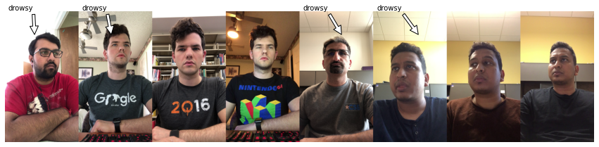
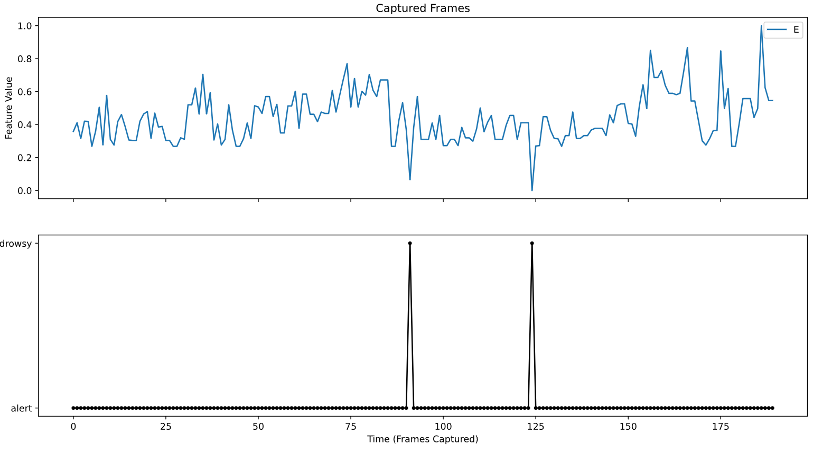

# Overview

According to the National Highway Traffic Safety Administration, every year about 100,000 police-reported crashes involve drowsy driving. These crashes result in more than 1,550 fatalities and 71,000 injuries. Detecting a fatigued driver is therefore vital equipment in modern vehicles. If you don't have the money for an such a vehicle, a DIY solution with Python might be the appropriate answer ;)

For the training data we will use the real-life drowsiness video dataset provided by the University of Texas [(UTA)](https://sites.google.com/view/utarldd/home). These data are free to use for scientific or educational purposes and identities cannot be inferred based on these data only.

# The real-time drowsiness dataset

UTA dataset consists of 180 RGB videos of 60 unique participants. Each video is around 10 minutes long, and is labeled as belonging to one of three classes: alert (labeled as 0), low vigilant (labeled as 5) and drowsy (labeled as 10). The labels were provided by the participants themselves, based on their predominant state while recording each video

However, we were able to download and analyze the video files of 18 participants. We extracted 240 frames per video from which we then derived the training data.

# Aim

We use the following three variants to enable real-time drowsiness detection:

1. Feature based classification with KNN as baseline classifier
2. A CNN with 2 convolutional layers
3. Greedy way of drowsiness detection entirely without machine learning

It is recommended to keep the structure of the repository. Since we are not allowed/able to upload all the videos and used images, you will have to download them from [UTA](https://sites.google.com/view/utarldd/home) yourself and then copy them into the subdirectories analogous to the script.
The necessary Python packages can be found in `drowsiness_imports.py` and in the `requirements.txt`.

# Results (v. 0.1)
The classifiers achieve different levels of accuracy. While KNN achieves a test accuracy of about 70% through some feature engineering, the CNN classifier shows a test accuracy of about 99%.
These are both very good values. However, the training data is strongly biased, which is more indicative of overfitting. Although we had used 240 images from each UTA participant, these are very similar. This is more due to the fact that there were only 18 individual persons who sat relatively motionless in front of their laptop. Here, a larger distortion would have to take place in order to achieve more reliable results.
Nevertheless, the two classifiers do work in principle. If someone puts his head on the table, he is probably considered tired. If someone blinks frequently, that could also indicate fatigue. Another method - which works entirely without training data - is **Option 3**. Here we define a threshold value. If this is exceeded, the person is considered tired. This is based on the assumption that people who fall into a state of fatigue often have their eyes closed for longer periods of time.
Accordingly, we can record in a graph and determine when a fatigue symptom has occurred.

# Results (v. 0.2)
Some additional training data was added. 
* For the KNN classifier, over 13,235 data series were collected using the metrics MOE, EAR, MAR, Circularity and their normalised forms.
* Currently, a total of 9,933 images of tired and awake persons are used for the CNN model, with the majority part coming from [UTA](https://sites.google.com/view/utarldd/home) video dataset.

With the new training data, the KNN classifier now achieves an F1 score of **92%**, which is a significant increase over the original version. With the CNN, on the other hand
no noticeable difference in terms of accuracy for the test data. It still fluctuates between **98%** and **99%**, which is a very good value. A closer look at the activation maps showed that the network also often learned the people's surroundings.

A further refinement of the network was to perform a kind of majority voted based classification. Here, the recognition system always collects an average of **20** images and notes the decisions of the classifications.
If the majority of these images indicate fatigue, the person is classified as drowsy, otherwise as vigilant. This minimizes any single misclassification and gives a more stable prediction model.

# Outlook
Use more unique tired persons and awake people and include more variance (e.g. different angles, ages, skins etc.). After all, a GUI for live detection is mandatory. Feel free to make further suggestions or updates ;)

